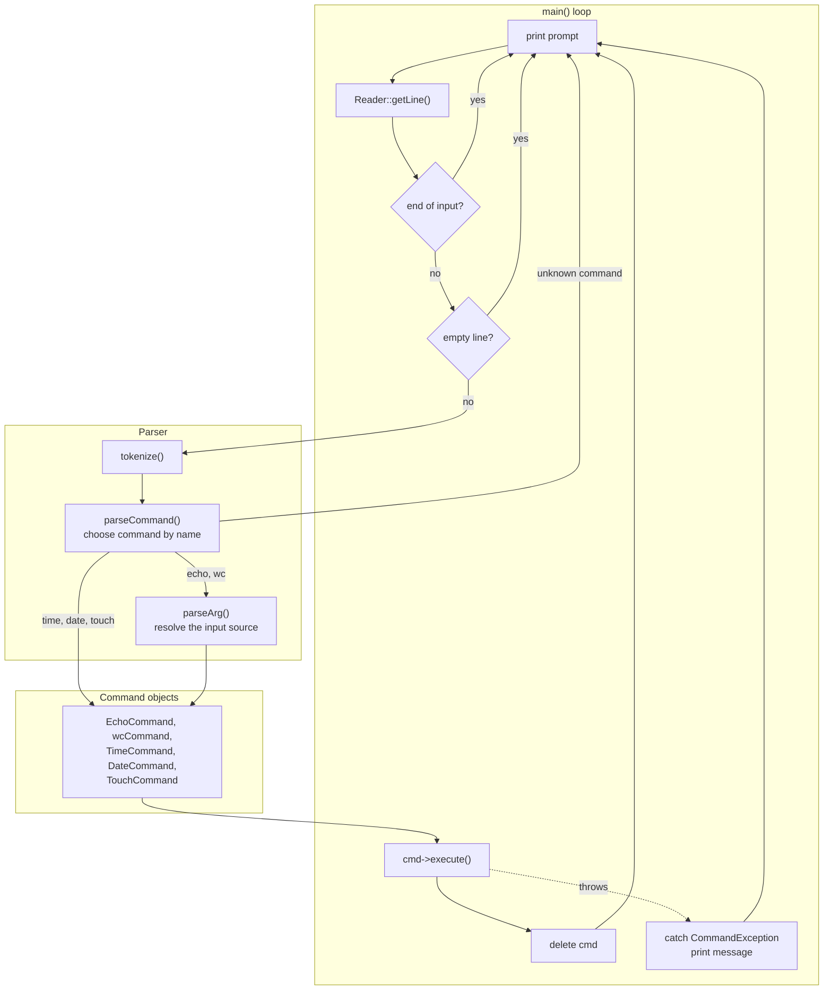
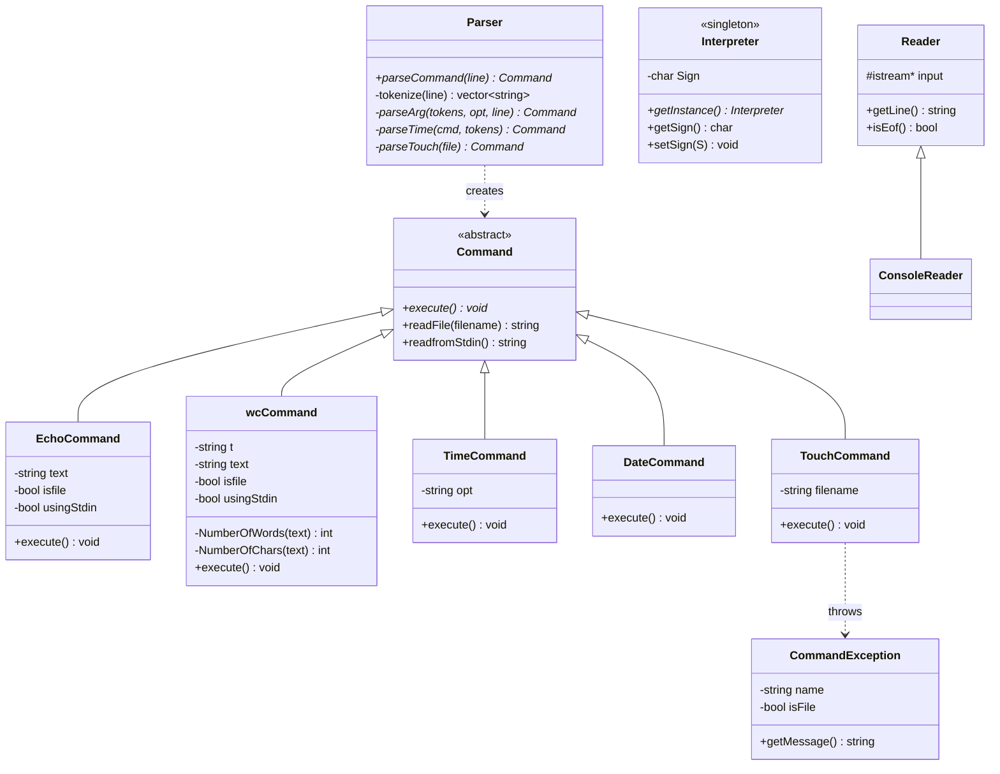
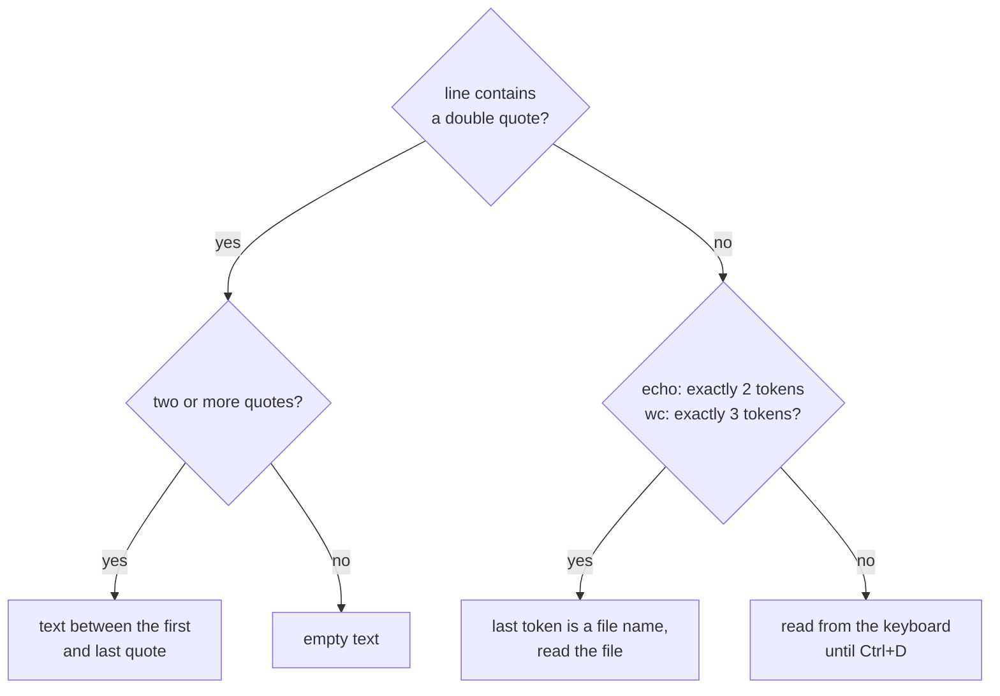

# minishell.cpp

A small Unix-style command line interpreter written in C++17 and built around the command pattern.
It has its own tokenizer and parser, one class per command and exception-based error reporting,
and supports five built-in commands that read their text from quoted arguments, files or the
keyboard.

```
$ echo "Hello world"
Hello world
$ wc -w "Lorem ipsum dolor sit amet"
5
$ time -h
17
```

Built as a course project for Object-Oriented Programming 1 at the School of Electrical
Engineering (ETF), University of Belgrade. This repository contains the **first phase** of the
assignment: `echo`, `time`, `date`, `touch` and `wc`.

---

## Table of contents

- [Features](#features)
- [Build and run](#build-and-run)
- [Command-line syntax](#command-line-syntax)
- [Architecture](#architecture)
- [How a line is processed](#how-a-line-is-processed)
- [Command reference](#command-reference)
- [Error handling](#error-handling)
- [Project layout](#project-layout)
- [Known limitations](#known-limitations)

---

## Features

- **5 commands**: `echo`, `time`, `date`, `touch`, `wc`
- **Three input sources** for `echo` and `wc`: quoted text, a file, or the keyboard (until `Ctrl+D`)
- **Options**: `wc -w` and `wc -c`, `time -h`, `-m` and `-s`
- **Command pattern**: every command is its own class derived from an abstract `Command`
- **Exception-based error reporting**: a failing command prints a message and never stops the
  interpreter
- **Configurable input source** through a `Reader` abstraction (console by default)

---

## Build and run

### Requirements

- A C++17 compiler (GCC, Clang or MSVC)
- CMake **3.10 or newer** (optional, a plain `g++` command works too)

### Build with CMake

```bash
cmake -S . -B build
cmake --build build
./build/cmi
```

### Build with g++

```bash
g++ -Iinclude -Iinclude/Commands main.cpp src/*.cpp src/commands/*.cpp -o cmi
./cmi
```

The interpreter starts with the prompt `$` and reads one command per line.

> **Note:** there is no `exit` command. Close the interpreter with `Ctrl+C`.
> See [Known limitations](#known-limitations).

---

## Command-line syntax

The general form of a command is:

```
command [-option] [argument]
```

A line is split into tokens on whitespace. For `echo` and `wc`, the argument decides where the
input text comes from:

| Argument | Input text | Example |
|----------|------------|---------|
| Quoted string | the text between the first and last `"` | `echo "hello world"` |
| Unquoted name | the contents of that file | `echo input.txt` |
| None | text typed on the keyboard until `Ctrl+D` | `echo` |

### Quoting

Text arguments are wrapped in double quotes. Everything between the first and the last quote on
the line is taken literally, including spaces:

```
$ echo "literal   text"       # prints the string, spaces preserved
literal   text
$ echo data.txt               # prints the contents of data.txt
```

---

## Architecture

The interpreter is a small pipeline: read a line, split it into tokens, build a command object,
execute it. Only the parser knows about command names, and only the command objects know how to do
their work.



### Command pattern

Every command implements the abstract `Command` class. `Parser::parseCommand` picks the concrete
class from the command name and returns a `Command*`, so `main` can execute any command without
knowing which one it is.



---

## How a line is processed

1. `main` prints the prompt from `Interpreter::getSign()` and reads a line through
   `Reader::getLine()`.
2. Empty lines are skipped. On end of input the stream state is cleared and the loop continues.
3. `Parser::parseCommand` splits the line into tokens and looks at the first one to pick a
   command.
4. For `echo` and `wc`, `Parser::parseArg` resolves where the input text comes from:



5. The parser returns a `Command*`. `main` calls `execute()` and then deletes the object.
6. If `execute()` throws a `CommandException`, `main` prints its message and the loop goes on.

---

## Command reference

| Command | Option | Input | Description |
|---------|--------|-------|-------------|
| `echo` | | quoted text, file or keyboard | Prints the input text |
| `time` | `-h`, `-m`, `-s` (optional) | none | Prints the current time as `HH:MM:SS`, or only the hours, minutes or seconds |
| `date` | | none | Prints the current date as `D.M.YYYY.` |
| `touch` | | file name (required) | Creates an empty file |
| `wc` | `-w` or `-c` (required) | quoted text, file or keyboard | Counts words (`-w`) or characters (`-c`) |

### Examples

```bash
# echo: quoted text, a file, or the keyboard
$ echo "hello world"
hello world
$ echo input.txt              # prints the file
$ echo                        # reads from the keyboard until Ctrl+D

# time and date
$ time
17:43:16
$ time -h
17
$ date
20.9.2026.

# wc: count words or characters
$ wc -w "one two three"
3
$ wc -w input.txt
5

# touch
$ touch made.txt
$ touch made.txt
File made.txt already exists
```

### Reading from the keyboard

`echo` and `wc` fall back to `Command::readfromStdin()` when they get no argument. It reads lines
until end of input, so finish with `Ctrl+D`:

```
$ wc -w
these lines are
collected until EOF
^D
5
```

---

## Error handling

Errors are reported through `CommandException`. It is thrown as a pointer from inside a command
and caught in `main`, which prints the message and deletes the exception, so a failing command
never stops the interpreter.

| Situation | Behaviour |
|-----------|-----------|
| `touch` on a file that already exists | `CommandException` is thrown, prints `File <name> already exists` |
| `touch` cannot create the file | prints `Can not make a file.` |
| Unknown command or wrong number of tokens | ignored, nothing is printed |
| File given to `echo` or `wc` does not exist | treated as empty text |

```
$ touch a.txt
$ touch a.txt
File a.txt already exists
```

---

## Project layout

```
minishell.cpp/
├── CMakeLists.txt
├── main.cpp                     main loop and top-level exception handling
├── include/
│   ├── Command.h                abstract command interface and input helpers
│   ├── Interpreter.h            singleton holding the command prompt
│   ├── Parser.h                 tokenizer and command factory
│   ├── Reader.h                 line input (Reader, ConsoleReader)
│   ├── Exceptions.h             CommandException
│   └── Commands/                one header per command
│       ├── EchoCommand.h   TimeCommand.h   DateCommand.h
│       └── TouchCommand.h  WcCommand.h
├── src/
│   ├── Command.cpp  Interpreter.cpp  Parser.cpp  Reader.cpp  Exception.cpp
│   └── commands/                one implementation per command
└── tests/                       sample input files and command scripts
```

### Design notes

- **Command pattern** keeps `main` free of per-command logic. Adding a command means adding a
  class and one case in `Parser::parseCommand`.
- **Shared input helpers** (`readFile`, `readfromStdin`) live in `Command`, so `echo` and `wc`
  do not duplicate them.
- **Singleton** `Interpreter` holds the prompt in one place.
- **`Reader` abstraction** separates line input from the console, so another input source can be
  added without touching `main`.

---

## Known limitations

- **No exit command.** At end of input (`Ctrl+D` at the prompt) the loop clears the stream state
  and continues. Close the program with `Ctrl+C`.
- **Unknown or malformed commands are silently ignored**, with no error message.
- **Input is limited to 512 characters** (quoted text, file contents and keyboard input).
- **A non-existent file** is treated as empty text by `echo` and `wc`, with no error message.
- **`wc -c` counts only non-whitespace characters**, not all characters in the text.
- **`wc` with an unknown option** prints nothing.
- **Redirection and pipes are not implemented** (second phase of the assignment): `echo "a" > x.txt`
  prints `a` on the screen and does not create a file.
