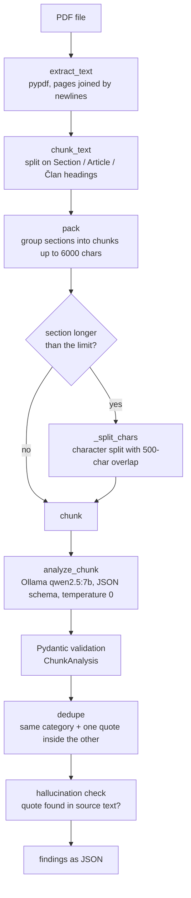
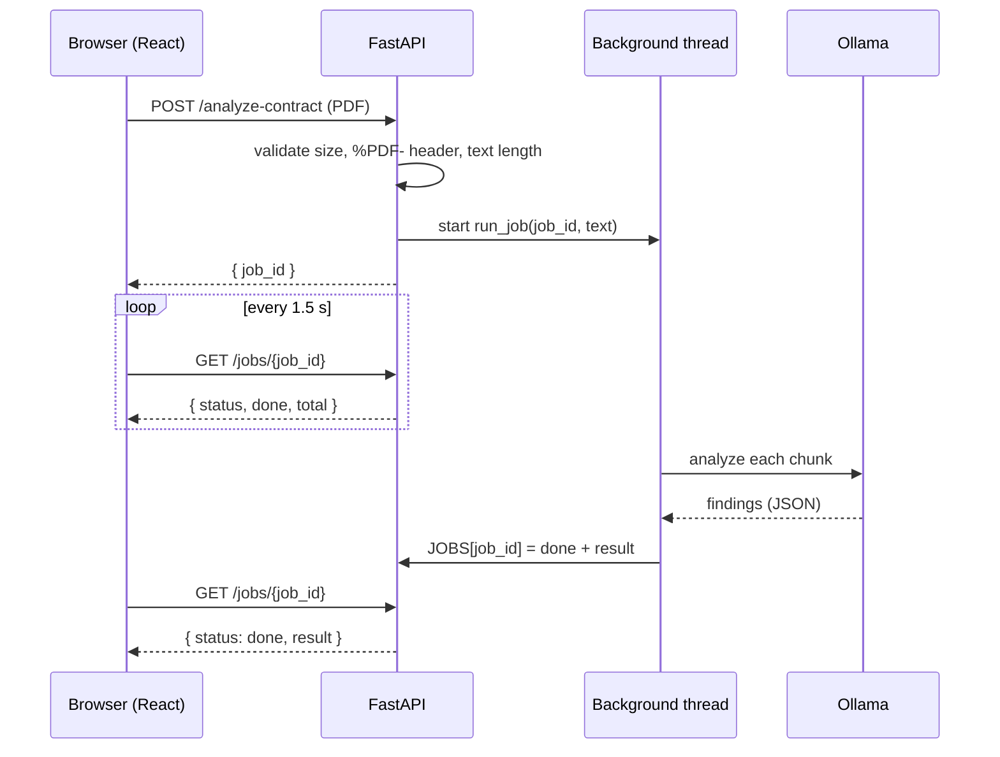
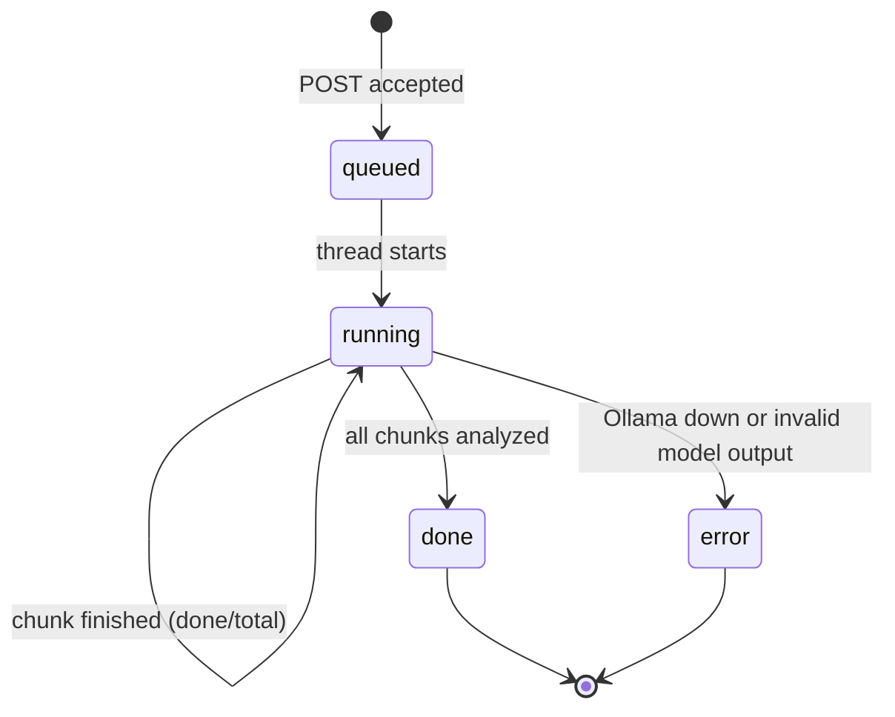

# Clausewise

A local AI tool that reads a contract PDF and points out the clauses worth a second look before
signing: penalties, payment terms, automatic renewal, termination and limitations of liability.
Every finding comes with the exact quote from the contract, a severity and a plain-language
explanation, and every quote is checked against the original text so the model cannot slip in a
clause that is not there.

```
$ python backend/cli.py eval/contracts/test.pdf
chunk 1/1
[
  {
    "category": "penalty",
    "severity": "high",
    "quote": "The Client shall pay a penalty of 5% per day for late payment.",
    "explanation": "A daily penalty of 5% adds up quickly and can exceed the invoice amount.",
    "hallucinated": false
  },
  ...
]
```

The model runs **locally** through [Ollama](https://ollama.com), so the contract never leaves the
machine. The pipeline is measured with its own evaluation script (recall, precision and
hallucinated quotes) rather than judged by eye.

> This is an automated analysis tool, not legal advice.

---

## Table of contents

- [Features](#features)
- [How it works](#how-it-works)
- [Tech stack](#tech-stack)
- [Setup](#setup)
- [Usage](#usage)
- [API](#api)
- [Evaluation](#evaluation)
- [Project structure](#project-structure)
- [Design decisions](#design-decisions)
- [Known limitations](#known-limitations)

---

## Features

- **Five risk categories**: `penalty`, `payment_terms`, `auto_renewal`, `termination`,
  `liability`, plus `other` for risky clauses that fit none of them.
- **Structured output**: the model is forced to answer in a fixed JSON schema, so every finding
  has the same four fields and an unknown category is rejected.
- **Hallucination check**: each quote is searched for in the original text; quotes that are not
  there are flagged instead of silently shown to the user.
- **Long contracts**: text is split on section headings (`Section`, `Article`, `Član`) and packed
  into chunks that fit the model's context, with an overlapping character split as a fallback.
- **Deduplication**: the same clause found in two overlapping chunks is reported once.
- **Background jobs with progress**: the API returns a job id immediately and the web page shows a
  progress bar while the contract is analyzed section by section.
- **Input validation**: size limit, real PDF check and scanned-PDF detection, each with a clear
  error message.
- **Evaluation script** that reports recall, precision and hallucinated quotes on a labelled set
  of contracts.

---

## How it works


```mermaid
flowchart TD
    A[PDF file] --> B[extract_text<br/>pypdf, pages joined by newlines]
    B --> C[chunk_text<br/>split on Section / Article / Član headings]
    C --> D[pack<br/>group sections into chunks up to 6000 chars]
    D --> E{section longer<br/>than the limit?}
    E -- yes --> F[_split_chars<br/>character split with 500-char overlap]
    E -- no --> G[chunk]
    F --> G
    G --> H[analyze_chunk<br/>Ollama qwen2.5:7b, JSON schema, temperature 0]
    H --> I[Pydantic validation<br/>ChunkAnalysis]
    I --> J[dedupe<br/>same category + one quote inside the other]
    J --> K[hallucination check<br/>quote found in source text?]
    K --> L[findings as JSON]
```

1. **Text extraction.** `pypdf` reads every page, and pages are joined with a newline so that a
   heading at the top of a page is not glued to the last sentence of the previous one.
2. **Chunking.** The model only sees a limited amount of text at once, so the contract is split in
   front of every section heading. A lookahead regex keeps the heading inside its section, which
   gives the model context ("Section 2. Payment"). Small sections are packed together into chunks
   of up to 6000 characters to save model calls. A section that is longer than the limit on its own
   is cut by characters with a 500-character overlap, so a short clause on the cut line is still
   whole in at least one chunk.
3. **Model call.** Each chunk is sent to a local model through Ollama's chat API. The Pydantic
   schema is converted to JSON Schema and passed as `format`, which constrains the model's output
   to that exact shape. `temperature: 0` makes the answers repeatable, which matters for
   evaluation.
4. **Validation.** The model's answer is parsed and validated with Pydantic. A category outside the
   allowed list or a missing field raises an error instead of reaching the user.
5. **Deduplication.** Overlapping chunks can report the same clause twice. Two findings are treated
   as duplicates when they have the same category and one quote contains the other; the one with
   the longer quote is kept.
6. **Hallucination check.** Quotes and the source text are compared after "squashing" (lowercase,
   rejoined hyphenated words, all whitespace removed), so a correct quote with different spacing
   still matches. A quote that is not in the contract is marked `hallucinated: true`.

### Request flow in the web app


```mermaid
sequenceDiagram
    participant U as Browser (React)
    participant A as FastAPI
    participant T as Background thread
    participant O as Ollama

    U->>A: POST /analyze-contract (PDF)
    A->>A: validate size, %PDF- header, text length
    A->>T: start run_job(job_id, text)
    A-->>U: { job_id }
    loop every 1.5 s
        U->>A: GET /jobs/{job_id}
        A-->>U: { status, done, total }
    end
    T->>O: analyze each chunk
    O-->>T: findings (JSON)
    T->>A: JOBS[job_id] = done + result
    U->>A: GET /jobs/{job_id}
    A-->>U: { status: done, result }
```

### Job states


```mermaid
stateDiagram-v2
    [*] --> queued: POST accepted
    queued --> running: thread starts
    running --> running: chunk finished (done/total)
    running --> done: all chunks analyzed
    running --> error: Ollama down or invalid model output
    done --> [*]
    error --> [*]
```

---

## Tech stack

| Layer | Tools |
|---|---|
| Backend | Python, FastAPI, Uvicorn, Pydantic, pypdf, requests |
| Model | `qwen2.5:7b` through Ollama, running locally |
| Frontend | React, TypeScript, Vite |
| Evaluation | Plain Python script over labelled contracts |

---

## Setup

Requirements: Python 3.11+, Node.js 18+ and [Ollama](https://ollama.com).

**1. Model**

```bash
ollama pull qwen2.5:7b
```

**2. Backend**

```bash
cd backend
python3 -m venv .venv
source .venv/bin/activate
pip install -r requirements.txt
uvicorn main:app --reload --port 8000
```

The interactive API docs are then available at http://localhost:8000/docs.

**3. Frontend** (in a second terminal)

```bash
cd frontend
npm install
npm run dev
```

Open http://localhost:5173.

---

## Usage

**Web app.** Choose a contract PDF, click **Analyze**, and watch the progress bar. When the
analysis finishes, each finding is shown as a card whose left border is colored by severity
(red = high, orange = medium, green = low). Findings whose quote was not found in the contract
carry a warning.

**Command line.** The same pipeline without the web layer:

```bash
cd backend
python cli.py ../eval/contracts/test.pdf
```

Progress goes to `stderr` and the findings are printed to `stdout` as JSON, so the output can be
redirected to a file:

```bash
python cli.py contract.pdf > findings.json
```

---

## API

### `POST /analyze-contract`

Multipart form upload with the PDF in the `file` field. Returns a job id immediately; the analysis
runs in the background.

```json
{ "job_id": "948c524ed1414331a9592f10f12a7bfd" }
```

| Code | When |
|---|---|
| `200` | Accepted, analysis started |
| `400` | The file is not a PDF (does not start with `%PDF-`) |
| `413` | The file is larger than 10 MB |
| `422` | The PDF cannot be read, or it has almost no text (probably a scan) |

### `GET /jobs/{job_id}`

Returns the current state of a job.

```json
{ "status": "running", "done": 2, "total": 5 }
```

```json
{ "status": "done", "result": [ { "category": "penalty", "severity": "high", "quote": "...", "explanation": "...", "hallucinated": false } ] }
```

```json
{ "status": "error", "error": "Ollama is not running. Start it with: ollama serve" }
```

Unknown ids return `404`.

---

## Evaluation

```bash
cd backend
python run_eval.py
```

The script runs the full pipeline on every PDF in `eval/contracts/` and compares the findings with
the hand-labelled file of the same name in `eval/expected/`:

```json
{
  "must_find": [
    { "category": "penalty", "quote_contains": "5% per day" }
  ],
  "must_not_flag": [
    { "quote_contains": "due within 15 days" }
  ]
}
```

- A **hit** is a `must_find` item for which the model returned a finding with the same category
  and a quote containing `quote_contains`.
- A **miss** is a `must_find` item the model did not return.
- A **false alarm** is a `must_not_flag` clause (a normal, fair clause) that the model reported as
  risky, in any category.

From these the script reports **recall** (how many real risks were found), **precision** (how many
reported clauses were really risky) and the number of hallucinated quotes.

The set has two contracts: one with four risky clauses and one control contract with only standard,
mutual clauses, used to check that the model does not invent problems.

### Results

| Prompt version | Recall | Precision | Hallucinated quotes |
|---|---|---|---|
| Categories only listed | 3/4 (75%) | 3/3 (100%) | 0 |
| Categories defined, with the penalty / payment boundary | **4/4 (100%)** | **4/4 (100%)** | 0 |

The first run showed a single, specific error: a late-payment penalty was classified as
`payment_terms` instead of `penalty`. The clause was found, but in the wrong category. The prompt
only listed the categories, and "a penalty for late payment" fits both. Adding a one-sentence
definition for each category, and stating explicitly that late-payment penalties belong to
`penalty`, fixed the miss without adding any false alarms on the control contract.

These numbers come from a very small set, and the prompt was tuned while looking at it, so they
show that the fix worked on the known case, not how well the tool generalizes. See
[Known limitations](#known-limitations).

---

## Project structure

```
ai-contract-analyzer/
├── backend/
│   ├── pdf_utils.py     # text extraction, normalization, chunking
│   ├── schemas.py       # Pydantic models: Finding, ChunkAnalysis
│   ├── llm.py           # Ollama call, prompt, structured output
│   ├── cli.py           # squash, dedupe, analyze_text pipeline, CLI entry point
│   ├── main.py          # FastAPI app: validation, background jobs, CORS
│   ├── run_eval.py      # recall / precision / hallucination evaluation
│   └── requirements.txt
├── eval/
│   ├── contracts/       # test contracts (PDF)
│   └── expected/        # hand-labelled must_find / must_not_flag per contract
└── frontend/
    └── src/
        ├── App.tsx      # upload, polling, progress bar, finding cards
        └── index.css
```

The pipeline lives in one function, `analyze_text()` in `cli.py`. The command line tool, the API
and the evaluation script all call it, so the evaluation measures exactly the code the app runs.
It takes an optional `on_progress(done, total)` callback: the CLI uses it to print progress, and
the API uses it to update the job's progress bar.

---

## Design decisions

**Local model instead of a cloud API.** Contracts contain names, amounts and terms that people
often cannot or do not want to send to a third party. A local model keeps the document on the
machine, costs nothing per call (so the evaluation can be rerun freely) and does not change
behind the scenes. The trade-off is a weaker and slower model than the largest cloud ones. All
model access is isolated in `llm.py`, so swapping in another model or provider touches one file.

**Schema-constrained output.** Asking a model for "JSON please" still produces broken or
inconsistent answers. Passing the Pydantic schema to Ollama restricts what the model can generate,
and validating the answer with the same schema catches anything that still goes wrong.

**Flag, do not delete, suspicious quotes.** A quote that is not in the contract is kept and marked,
so the user sees that something was found but should be double-checked.

**Background thread instead of a long request.** Analysis can take minutes on a long contract.
Returning a job id right away and polling avoids request timeouts and lets the page show progress.
Jobs are stored in a dictionary protected by a `threading.Lock`, which is held only while the
dictionary is read or written, never during the model call.

**Validation before the expensive work.** Size and the `%PDF-` header are checked first, then text
extraction, and only then the model. The file is read with a limit of 10 MB + 1 byte, so an
oversized upload is rejected without loading all of it into memory.

---

## Known limitations

- **Small evaluation set.** Two contracts and four labelled risks are enough to catch a specific
  error, not to measure real-world accuracy. The prompt was adjusted while looking at this set.
- **Scanned PDFs are not supported.** There is no OCR; a scan is rejected with a `422` message.
- **Jobs live in memory.** Restarting the server loses all jobs, and there is no limit on how many
  analyses run at the same time.
- **Heading detection is simple.** The section regex also matches a heading word that appears in
  the middle of a sentence ("as described in Section 3"), which can split a clause.
- **Mostly tested on English contracts.** Serbian headings (`Član`) are recognized when chunking,
  but the evaluation set does not yet contain Serbian contracts.
- **Not legal advice.** The tool helps a reader focus on the right clauses; it does not replace a
  lawyer.


---

## Data and license

The evaluation set includes 16 contracts from the
[Contract Understanding Atticus Dataset (CUAD) v1](https://www.atticusprojectai.org/cuad),
created by The Atticus Project and licensed under
[CC BY 4.0](https://creativecommons.org/licenses/by/4.0/).
The contracts are real commercial agreements from public SEC EDGAR filings, and the clause
labels were made by lawyers. `backend/import_cuad.py` selects the contracts and converts the
CUAD labels into this project's categories: Renewal Term → `auto_renewal`, Termination For
Convenience → `termination`, Cap On Liability → `liability`, Liquidated Damages → `penalty`.