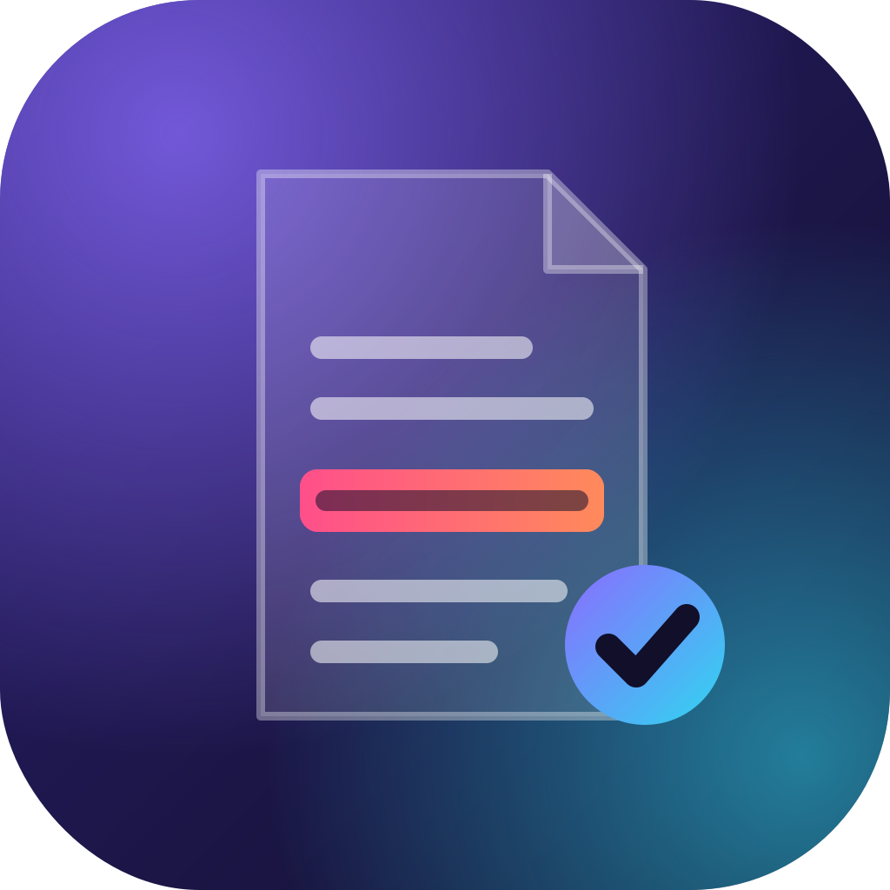
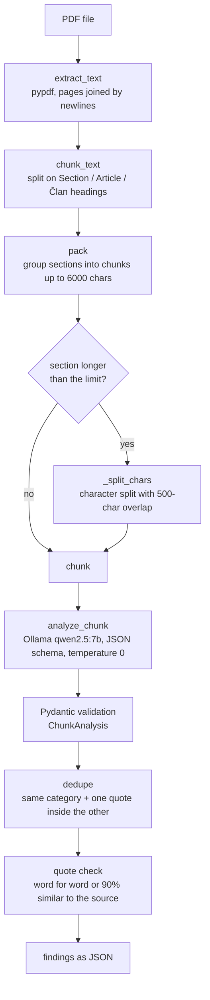
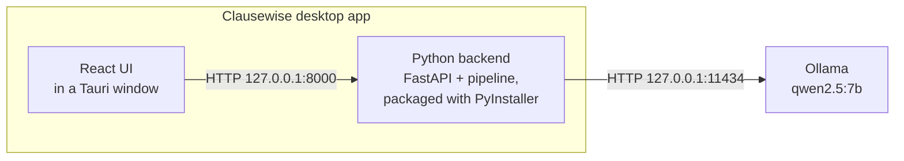
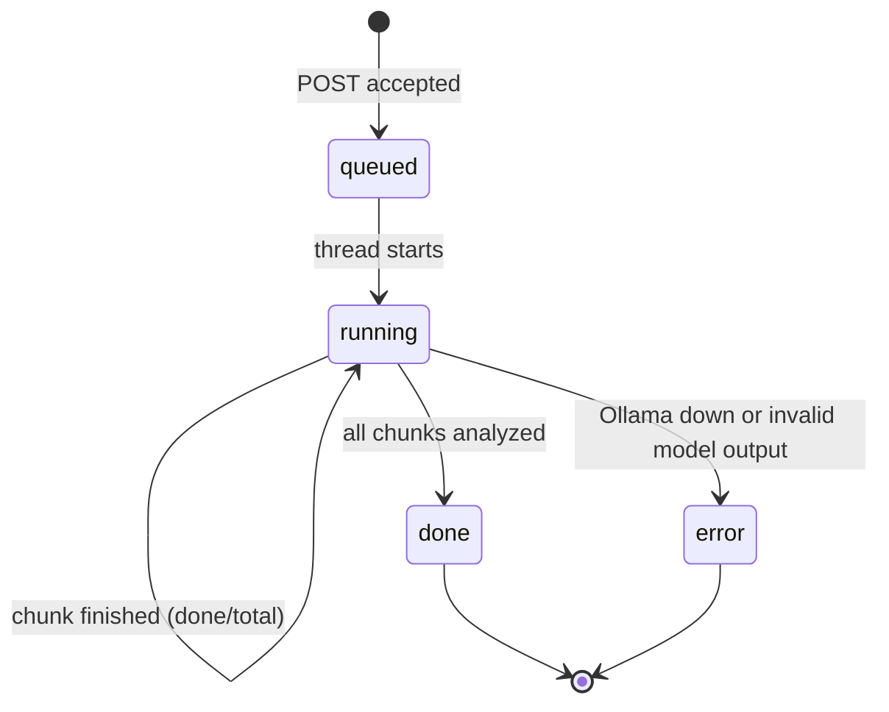

<p align="center">
  
</p>

# Clausewise

A local AI desktop app that reads a contract and points out the clauses worth a second look
before signing: penalties, payment terms, automatic renewal, termination and limitations of
liability. Every finding comes with the quote from the contract, a severity and a plain-language
explanation, and every quote is checked against the original text so the model cannot slip in a
clause that is not there.

The model runs **locally** through [Ollama](https://ollama.com), so the contract never leaves the
computer. Quality is measured, not judged by eye: the pipeline is evaluated on real commercial
contracts labelled by lawyers ([CUAD](#data-and-license)), with a separate held-out set, a record
of every prompt experiment and a comparison of three models.

**[Download for Linux (.deb)](https://github.com/zoki8/ai-contract-analyzer/releases)**

```
$ python backend/cli.py eval/contracts/test.pdf
chunk 0/1
chunk 1/1
[
  {
    "category": "penalty",
    "severity": "high",
    "quote": "The Client shall pay a penalty of 5% per day for late payment.",
    "explanation": "A daily penalty of 5% adds up quickly and can exceed the invoice amount.",
    "hallucinated": false
  },
  ...
]
```

> This is an automated analysis tool, not legal advice.

---

## Table of contents

- [Results at a glance](#results-at-a-glance)
- [Features](#features)
- [Install](#install)
- [How it works](#how-it-works)
- [Tech stack](#tech-stack)
- [Development setup](#development-setup)
- [Usage](#usage)
- [API](#api)
- [Evaluation](#evaluation)
- [Tests](#tests)
- [Project structure](#project-structure)
- [Design decisions](#design-decisions)
- [Known limitations](#known-limitations)
- [Data and license](#data-and-license)

---

## Results at a glance

Measured with `qwen2.5:7b` on 18 contracts (16 from CUAD, 2 written for the project).

| Set | Recall | Hallucinated quotes |
|---|---|---|
| Tuning set (8 CUAD + 1 own contract, used while writing the prompt) | 21/28 (75%) | 1 |
| **Held-out set (8 CUAD contracts never looked at while tuning)** | **14/24 (58%)** | 1 |
| All 18 contracts | 35/52 (67%) | 2 |

No false alarms on the standard clauses the model must not flag. The held-out number is the honest
one: on unseen, longer contracts the model finds a little more than half of the clauses lawyers
marked. [Why, and what was tried](#what-the-errors-show).

---

## Features

- **Five risk categories**: `penalty`, `payment_terms`, `auto_renewal`, `termination`,
  `liability`, plus `other` for risky clauses that fit none of them.
- **Structured output**: the model is forced to answer in a fixed JSON schema, so every finding
  has the same four fields and an unknown category is rejected.
- **Quote check**: each quote is searched for in the original text. Word-for-word and
  near-verbatim quotes (90% or more of the characters agree) are accepted; anything else is shown
  with a warning instead of being silently trusted.
- **Long contracts**: text is split on section headings (`Section`, `Article`, `Član`) and packed
  into chunks that fit the model's context, with an overlapping character split as a fallback.
- **Deduplication**: the same clause found in two overlapping chunks is reported once.
- **Desktop app**: a Tauri window that starts its own packaged Python backend. No terminal,
  Python or Node.js needed to use it.
- **Background jobs with progress**: the analysis runs section by section while the window shows a
  progress bar.
- **Input validation**: size limit, real-PDF check and scanned-PDF detection, each with a clear
  message.
- **Evaluation and tests**: recall, precision and hallucinated quotes on labelled contracts, a
  model comparison script, and 31 unit and API tests.

---

## Install

Requirements: Linux (x86-64) and [Ollama](https://ollama.com) with the model:

```bash
ollama pull qwen2.5:7b
```

Download `Clausewise_0.1.0_amd64.deb` from
[Releases](https://github.com/zoki8/ai-contract-analyzer/releases) and install it:

```bash
sudo apt install ./Clausewise_0.1.0_amd64.deb
```

Start **Clausewise** from the application menu. Ollama has to be running in the background.

---

## How it works

### The analysis pipeline


```mermaid
flowchart TD
    A[PDF file] --> B[extract_text<br/>pypdf, pages joined by newlines]
    B --> C[chunk_text<br/>split on Section / Article / Član headings]
    C --> D[pack<br/>group sections into chunks up to 6000 chars]
    D --> E{section longer<br/>than the limit?}
    E -- yes --> F[_split_chars<br/>character split with 500-char overlap]
    E -- no --> G[chunk]
    F --> G
    G --> H[analyze_chunk<br/>Ollama qwen2.5:7b, JSON schema, temperature 0]
    H --> I[Pydantic validation<br/>ChunkAnalysis]
    I --> J[dedupe<br/>same category + one quote inside the other]
    J --> K[quote check<br/>word for word or 90% similar to the source]
    K --> L[findings as JSON]
```

1. **Text extraction.** `pypdf` reads every page; pages are joined with a newline so a heading at
   the top of a page is not glued to the last sentence of the previous one.
2. **Chunking.** The model sees a limited amount of text at once, so the contract is split in front
   of every section heading. A lookahead regex keeps the heading inside its section, which gives the
   model context ("Section 2. Payment"). Small sections are packed into chunks of up to 6000
   characters to save model calls; a section longer than the limit on its own is cut by characters
   with a 500-character overlap, so a short clause on the cut line is whole in at least one chunk.
3. **Model call.** Each chunk goes to a local model through Ollama's chat API. The Pydantic schema
   is passed as `format`, which constrains the output to that exact shape, and `temperature: 0`
   makes runs repeatable (two runs of the same prompt gave identical results).
4. **Validation.** The answer is parsed and validated with Pydantic, so a category outside the
   allowed list or a missing field raises an error instead of reaching the user.
5. **Deduplication.** Overlapping chunks can report the same clause twice. Two findings with the
   same category where one quote contains the other are merged, keeping the longer quote.
6. **Quote check.** Quotes and the source are compared after "squashing" (lowercase, hyphenated
   words rejoined, whitespace removed). A quote that is not there word for word is located at its
   best-matching position in the text and accepted if at least 90% of it agrees, because the model
   sometimes changes one word in a long legal sentence. Everything else is marked `hallucinated`.

### The desktop app


```mermaid
flowchart LR
    subgraph App[Clausewise desktop app]
        UI[React UI<br/>in a Tauri window] -- HTTP 127.0.0.1:8000 --> BE[Python backend<br/>FastAPI + pipeline,<br/>packaged with PyInstaller]
    end
    BE -- HTTP 127.0.0.1:11434 --> OL[Ollama<br/>qwen2.5:7b]
```

The backend is a PyInstaller binary bundled as a Tauri **sidecar**. When the window opens, the Rust
side starts it; when the window closes, it stops it. Both sides only listen on `127.0.0.1`, so
nothing is reachable from the network.

### Request flow


```mermaid
sequenceDiagram
    participant U as Window (React)
    participant A as FastAPI
    participant T as Background thread
    participant O as Ollama

    U->>A: POST /analyze-contract (PDF)
    A->>A: validate size, %PDF- header, text length
    A->>T: start run_job(job_id, text)
    A-->>U: { job_id }
    loop every 1.5 s
        U->>A: GET /jobs/{job_id}
        A-->>U: { status, done, total }
    end
    T->>O: analyze each chunk
    O-->>T: findings (JSON)
    T->>A: JOBS[job_id] = done + result
    U->>A: GET /jobs/{job_id}
    A-->>U: { status: done, result }
```

### Job states


```mermaid
stateDiagram-v2
    [*] --> queued: POST accepted
    queued --> running: thread starts
    running --> running: chunk finished (done/total)
    running --> done: all chunks analyzed
    running --> error: Ollama down or invalid model output
    done --> [*]
    error --> [*]
```

---

## Tech stack

| Layer | Tools |
|---|---|
| Pipeline and API | Python, FastAPI, Uvicorn, Pydantic, pypdf, requests |
| Model | `qwen2.5:7b` through Ollama, running locally |
| Frontend | React, TypeScript, Vite |
| Desktop | Tauri 2 (Rust), backend packaged with PyInstaller as a sidecar |
| Evaluation | CUAD contracts, own scripts for recall, precision and model comparison |
| Tests | pytest, FastAPI TestClient |

---

## Development setup

Requirements: Python 3.11+, Node.js 18+, Rust and the
[Tauri prerequisites](https://v2.tauri.app/start/prerequisites/), and Ollama with
`qwen2.5:7b`.

**Backend and web UI (two terminals):**

```bash
python3 -m venv .venv
source .venv/bin/activate
pip install -r backend/requirements.txt
cd backend
uvicorn main:app --reload --port 8000
```

```bash
cd frontend
npm install
npm run dev          # http://localhost:5173
```

**Desktop app.** Package the backend once, place it where Tauri expects the sidecar, then run or
build the app:

```bash
cd backend
pyinstaller --onefile --name clausewise-backend --collect-submodules uvicorn server.py
cd ..
mkdir -p frontend/src-tauri/binaries
cp backend/dist/clausewise-backend \
   frontend/src-tauri/binaries/clausewise-backend-$(rustc -Vv | grep host | cut -d' ' -f2)

cd frontend
npm run tauri dev     # window with hot reload
npm run tauri build   # .deb and .rpm in src-tauri/target/release/bundle/
```

---

## Usage

**Desktop app.** Drop a contract PDF into the window or click to choose one, then **Analyze
contract**. When the analysis finishes, a risk bar shows the mix of high, medium and low findings,
and each finding is a card with its category, severity, the quote and an explanation, sorted with
the highest risk first. Quotes that could not be found in the contract carry a warning.

**Command line.** The same pipeline without the UI:

```bash
cd backend
python cli.py ../eval/contracts/test.pdf > findings.json
```

Progress goes to `stderr` and the findings to `stdout`.

---

## API

### `POST /analyze-contract`

Multipart upload with the PDF in the `file` field. Returns a job id immediately; the analysis runs
in the background.

```json
{ "job_id": "948c524ed1414331a9592f10f12a7bfd" }
```

| Code | When |
|---|---|
| `200` | Accepted, analysis started |
| `400` | The file is not a PDF (does not start with `%PDF-`) |
| `413` | The file is larger than 10 MB |
| `422` | The PDF cannot be read, or it has almost no text (probably a scan) |

### `GET /jobs/{job_id}`

```json
{ "status": "running", "done": 2, "total": 5 }
```

```json
{ "status": "done", "result": [ { "category": "penalty", "severity": "high", "quote": "...", "explanation": "...", "hallucinated": false } ] }
```

```json
{ "status": "error", "error": "Ollama is not running. Start it with: ollama serve" }
```

Unknown ids return `404`.

---

## Evaluation

### Data

| Set | Contracts | Purpose |
|---|---|---|
| Tuning | `cuad_01`–`cuad_08`, `test.pdf` | looked at while changing the prompt |
| Held-out | `cuad_09`–`cuad_16` | added only after tuning; the honest score |
| Control | `test2.pdf` | only standard, mutual clauses; checks the model does not invent risks |

The CUAD contracts are real agreements labelled by lawyers. `backend/import_cuad.py` picks the
shortest contracts that contain at least three of the project's categories and turns the lawyers'
highlighted clauses into test cases. The held-out contracts are longer (22 to 30 thousand
characters against 8 to 19 thousand), which is part of why they score lower.

### Metrics

For every contract, `eval/expected/<name>.json` lists clauses the model **must find** and standard
clauses it **must not flag** (for CUAD, the governing-law clause):

- **hit**: a finding with the same category whose quote matches the labelled clause (word for word
  or at least 90% similar, or a meaningful part of a longer labelled clause);
- **miss**: a labelled clause the model did not return in that category;
- **false alarm**: a must-not-flag clause reported as risky in any category.

**Recall** = hits / (hits + misses). **Precision** = hits / (hits + false alarms), which only
counts the clauses known to be harmless: CUAD does not label what is *not* risky, so a wrongly
flagged clause outside that list is not counted. **Hallucinated quotes** are findings whose quote
is not in the contract.

```bash
cd backend
python import_cuad.py path/to/cuad/data.zip --n 16 --max-chars 30000
python run_eval.py --model qwen2.5:7b
python compare_results.py
```

### Prompt experiments

Each change to the prompt was measured separately on the tuning set (strict word-for-word quote
matching at the time).

| Prompt version | Recall | Hallucinated quotes | Kept? |
|---|---|---|---|
| Categories only listed (first run, 2 own contracts) | 3/4 | 0 | no |
| Categories defined, with the penalty / payment boundary | 21/28 (75%) | 5 | yes |
| + "classify by effect, not wording" + "no placeholder findings" | 19/28 (68%) | 2 | no |
| + "no placeholder findings" only | **21/28 (75%)** | **1** | **yes** |

The third row changed two things at once and made recall worse, so the two rules were tested
separately. The placeholder rule alone removed findings like `"Not applicable in the provided
text."` without losing any clause; the classification rule made the model more cautious and it
started skipping real clauses, so it was dropped.

### Measuring quotes fairly

Several "hallucinations" were real clauses quoted with one word changed, and the same clause was
also counted as a miss. Accepting near-verbatim quotes changed the measurement, not the model:

| Quote matching | All 18 | Held-out | Hallucinated quotes |
|---|---|---|---|
| word for word | 34/52 (65%) | 13/24 (54%) | 6 |
| near-verbatim (90%) | 35/52 (67%) | 14/24 (58%) | 2 |

### Model comparison

All 18 contracts, same prompt, on a laptop RTX 2050 with 4 GB of memory.

| Model | Recall | Precision | Hallucinated quotes | Time |
|---|---|---|---|---|
| **qwen2.5:7b** | 35/52 (67%) | **100%** | **2** | 15 to 21 min |
| qwen2.5:3b | 29/52 (56%) | 91% | 13 | 9 min |
| llama3.2:3b | **45/52 (87%)** | 83% | 41 | 25 min |

`llama3.2:3b` has the highest recall because it reports almost everything: 9 false alarms,
including an ordinary 30-day payment term, and 41 invented findings such as `"None"`. It ignores the
instruction to return an empty list. `qwen2.5:3b` fits entirely in the 4 GB GPU and is twice as
fast, but also ignores the placeholder rule and flags standard clauses. `qwen2.5:7b` does not fit
in 4 GB and runs partly on the CPU, but when it reports something it is almost always right, so it
is the default. For a tool people use before signing, a false alarm or an invented quote costs more
than a missed clause. The llama time is less reliable than the others: it generates far more
output, and other work was running on the machine during that run.

### What the errors show

- **Automatic renewal is the weakest category.** Clauses as clear as "this Agreement shall
  automatically be renewed" are often not reported, or reported as `termination` because they
  mention termination ("unless terminated...").
- **The model classifies by wording.** Clauses that mention termination tend to become
  `termination` even when they are a fee (penalty) or a limit on damages (liability).
- **Part of the gap is a definition gap.** CUAD marks clauses a lawyer should review, not only
  risky ones. A mutual "either party may terminate with 90 days notice" is labelled by CUAD, but the
  prompt deliberately treats fair, mutual clauses as not risky. An optional renewal right is
  labelled "Renewal Term" in CUAD but is not automatic renewal.

---

## Tests

```bash
cd backend
pytest -v
```

31 tests cover text extraction, normalization, chunking (splitting, packing, overlap, limits),
deduplication, near-verbatim quote matching, the evaluation matching rules and API validation
(400, 413, 422, 404, and a real upload). None of them needs the model. One more test is marked
`xfail`: it documents a known limitation (a heading mentioned inside a sentence also splits the
text) and will start passing when that is fixed.

---

## Project structure

```
ai-contract-analyzer/
├── backend/
│   ├── pdf_utils.py         # text extraction, normalization, chunking
│   ├── schemas.py           # Pydantic models: Finding, ChunkAnalysis
│   ├── llm.py               # Ollama call, prompt, structured output
│   ├── cli.py               # quote check, dedupe, analyze_text pipeline, CLI entry point
│   ├── main.py              # FastAPI app: validation, background jobs, CORS
│   ├── server.py            # entry point for the packaged backend (sidecar)
│   ├── run_eval.py          # recall / precision / hallucination evaluation
│   ├── import_cuad.py       # builds evaluation cases from CUAD
│   ├── compare_results.py   # model comparison table
│   ├── test_pipeline.py     # pytest suite
│   └── requirements.txt
├── eval/
│   ├── contracts/           # CUAD contracts (.txt) and own test contracts (.pdf)
│   ├── expected/            # must_find / must_not_flag per contract
│   └── results/             # one summary per evaluated model
└── frontend/
    ├── src/                 # React app: upload, progress, risk bar, finding cards
    └── src-tauri/           # Tauri desktop shell (Rust), icons, sidecar config
```

The pipeline lives in one function, `analyze_text()` in `cli.py`. The command line tool, the API
and the evaluation all call it, so the evaluation measures exactly the code the app runs. An
optional `on_progress(done, total)` callback lets the CLI print progress and the API update the
progress bar.

---

## Design decisions

**Local model instead of a cloud API.** Contracts contain names, amounts and terms that people often
cannot send to a third party. A local model keeps the document on the machine, costs nothing per
call (so the evaluation can be rerun freely) and does not change behind the scenes. The trade-off
is a weaker, slower model; all model access is isolated in `llm.py`, so another model or provider
touches one file.

**Schema-constrained output.** Asking for "JSON please" still produces broken answers. Passing the
Pydantic schema to Ollama restricts what the model can generate, and validating with the same
schema catches anything that still goes wrong.

**Flag suspicious quotes, do not delete them.** A quote that is not in the contract stays visible
with a warning, so the user knows to check the original.

**Choose the model by more than one number.** The model with the highest recall was the least usable
one. The default was chosen by precision and hallucinations as well, because those are what a user
actually sees.

**A Python sidecar instead of rewriting the backend.** Python is where the model tooling is, so the
backend stays in Python and ships as a PyInstaller binary that Tauri starts and stops. The backend
also exits by itself if the app that started it disappears, so it never keeps port 8000 busy.

**Background thread instead of a long request.** Returning a job id and polling avoids request
timeouts and lets the window show progress. Jobs are stored in a dictionary guarded by a
`threading.Lock`, held only while the dictionary is read or written, never during a model call.

---

## Known limitations
- **Heading detection:** headings are split only after sentence-ending
  punctuation or a newline. Because text is normalized to one line before
  chunking, a heading preceded by a title (e.g. "TERMINATION Section 7")
  may not be split.
- **Small evaluation set.** 16 CUAD contracts and 52 labelled clauses are enough to find patterns,
  not to give a precise accuracy. One clause more or less moves recall on the held-out set by 4
  points.
- **Precision is only partly measured.** Only known harmless clauses are checked, so the 100% is an
  upper bound.
- **CUAD categories are an approximation** of this project's categories (see
  [What the errors show](#what-the-errors-show)).
- **Automatic renewal is often missed**, the clearest remaining weakness.
- **Needs Ollama and a capable machine.** `qwen2.5:7b` takes about 5 GB; on a 4 GB GPU it runs partly
  on the CPU and a long contract takes a couple of minutes.
- **Linux build only** for now, and no OCR: scanned PDFs are rejected.
- **Jobs live in memory** and are lost when the app closes.
- **Heading detection is simple**: "as described in Section 3" in the middle of a sentence also
  splits the text.
- **Not legal advice.**

---

## Data and license

The evaluation set includes 16 contracts from the
[Contract Understanding Atticus Dataset (CUAD) v1](https://www.atticusprojectai.org/cuad),
created by The Atticus Project and licensed under
[CC BY 4.0](https://creativecommons.org/licenses/by/4.0/).
The contracts are real commercial agreements from public SEC EDGAR filings, and the clause labels
were made by lawyers. `backend/import_cuad.py` selects the contracts and converts the CUAD labels
into this project's categories: Renewal Term → `auto_renewal`, Termination For Convenience →
`termination`, Cap On Liability → `liability`, Liquidated Damages → `penalty`.
